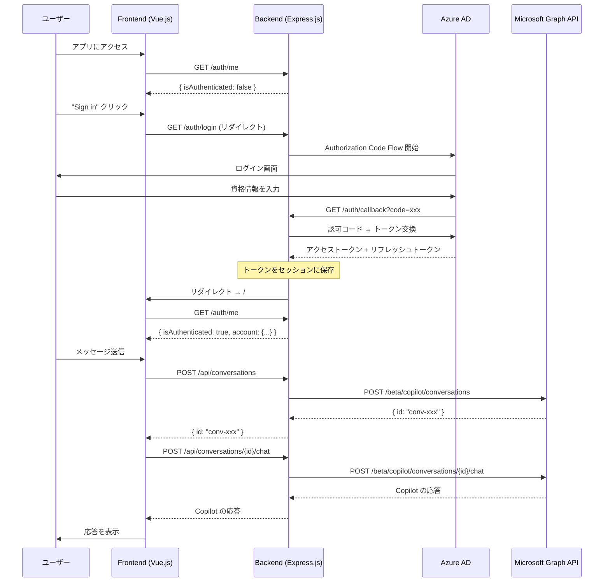
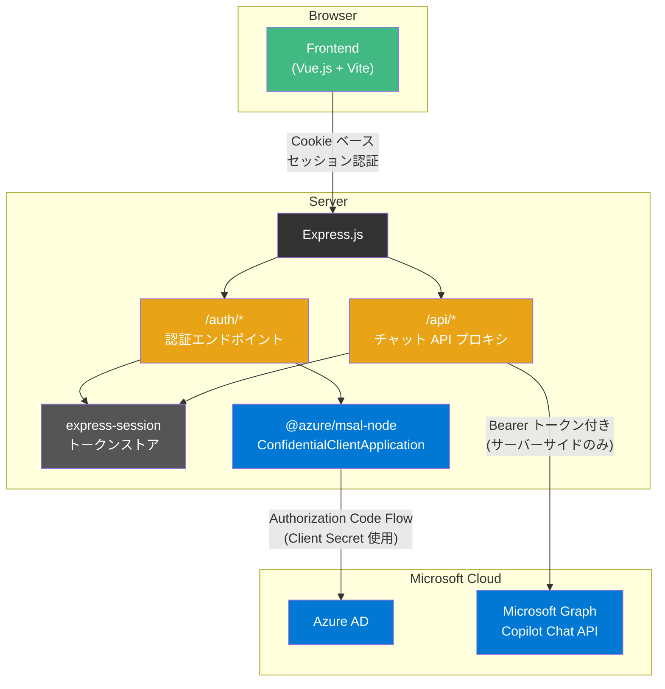

# server-mediated パターン

バックエンドが認証とトークン管理を担い、Microsoft Graph Copilot Chat API への呼び出しを仲介するパターン。

## アーキテクチャ





## ファイル構成

```
server-mediated/
├── package.json                 # スクリプト集約
├── .env.example                 # 環境変数テンプレート
└── apps/
    ├── backend/
    │   ├── package.json
    │   └── src/
    │       ├── app.js               # createApp() ファクトリ
    │       ├── server.js            # startServer()
    │       ├── middleware/
    │       │   └── session.js       # express-session 設定
    │       ├── routes/
    │       │   ├── auth.js          # /auth/* 認証エンドポイント
    │       │   └── chat.js          # /api/* チャット API プロキシ
    │       ├── services/
    │       │   ├── tokenStore.js    # セッション内トークン管理
    │       │   └── graphClient.js   # Graph API 呼び出し
    │       └── __tests__/
    │           ├── app.test.js
    │           ├── auth.test.js
    │           └── chat.test.js
    └── frontend/
        ├── package.json
        ├── vite.config.js           # dev proxy 設定含む
        ├── index.html
        └── src/
            ├── main.js
            ├── App.vue
            ├── apiClient.js          # バックエンド API fetch ラッパー
            ├── components/
            │   ├── LoginButton.vue
            │   ├── ChatView.vue
            │   └── MessageBubble.vue
            ├── composables/
            │   ├── useAuth.js        # バックエンド認証状態管理
            │   └── useChat.js        # バックエンド API 経由チャット
            └── __tests__/
```

## API エンドポイント

### 認証 (`/auth`)

| メソッド | パス | 説明 |
|---------|------|------|
| GET | `/auth/login` | Azure AD ログインページへリダイレクト |
| GET | `/auth/callback` | OAuth コールバック。トークン交換しセッション保存 |
| POST | `/auth/logout` | セッション破棄 |
| GET | `/auth/me` | 認証状態返却。認証済み: `{ isAuthenticated: true, account }` / 未認証: 401 |

### チャット (`/api`) — 要認証

| メソッド | パス | 説明 |
|---------|------|------|
| POST | `/api/conversations` | Copilot 会話を新規作成 |
| POST | `/api/conversations/:id/chat` | メッセージ送信。Body: `{ text, timeZone? }` |

## 特徴

| 項目 | 内容 |
|------|------|
| 認証フロー | Authorization Code Flow (Confidential Client) |
| トークン管理 | サーバーセッション（express-session） |
| Graph API 呼び出し | バックエンドが代理 |
| フロントエンドの認証ライブラリ | 不要（MSAL なし） |
| セキュリティ | トークンがクライアントに露出しない |

## セットアップ

### 1. Azure AD アプリ登録

1. [Azure Portal](https://portal.azure.com/) → Azure Active Directory → アプリの登録
2. 「新規登録」→ リダイレクト URI に `http://localhost:3000/auth/callback` を Web として追加
3. 「証明書とシークレット」→ 新しいクライアントシークレットを作成
4. 「API のアクセス許可」で以下の Delegated 権限を追加:
   - `Sites.Read.All`, `Mail.Read`, `People.Read.All`
   - `OnlineMeetingTranscript.Read.All`, `Chat.Read`
   - `ChannelMessage.Read.All`, `ExternalItem.Read.All`
5. 「管理者の同意を与える」をクリック

### 2. 環境変数

```bash
cp server-mediated/.env.example server-mediated/.env
```

`.env` を編集:

```
AZURE_CLIENT_ID=<Azure AD アプリの Client ID>
AZURE_CLIENT_SECRET=<クライアントシークレット>
AZURE_TENANT_ID=<Azure AD テナント ID>
SESSION_SECRET=<ランダムな文字列>
REDIRECT_URI=http://localhost:3000/auth/callback
```

### 3. 開発

```bash
# ルートから
npm install

# バックエンド起動
npm run dev --workspace=server-mediated/apps/backend

# フロントエンド開発サーバー（別ターミナル）
npm run dev --workspace=server-mediated/apps/frontend

# テスト
npm test --workspace=server-mediated/apps/backend
npm test --workspace=server-mediated/apps/frontend
```

> **Note**: フロントエンド開発サーバー (Vite) は `/auth/*` と `/api/*` をバックエンド (`http://localhost:3000`) にプロキシする設定済み。

### 4. Docker Compose で起動

```bash
cd server-mediated

# .env に AZURE_CLIENT_ID, AZURE_CLIENT_SECRET, AZURE_TENANT_ID を設定済みであること
docker compose up --build
```

| サービス | URL | 説明 |
|---------|-----|------|
| frontend | http://localhost:8080 | Nginx（SPA 配信 + `/auth/*`, `/api/*` をバックエンドにプロキシ） |
| backend | http://localhost:3000 | Express.js（認証 + チャット API プロキシ） |

> **Note**: Azure AD のリダイレクト URI を `http://localhost:8080/auth/callback` に設定する必要がある。Nginx がフロントエンドへのリクエストと `/auth/*`, `/api/*` へのバックエンドプロキシを一元管理する。

## spa-direct パターンとの比較

| 項目 | spa-direct | server-mediated |
|------|-----------|----------------|
| トークンの所在 | ブラウザ | サーバー |
| Client Secret | 使用不可 | 使用可能 |
| XSS 時のリスク | トークン漏洩 | セッション Cookie のみ |
| リフレッシュトークン | 制限あり | サーバーで管理可能 |
| 実装の複雑さ | シンプル | 中程度 |
| バックエンドの必要性 | ほぼ不要 | 必須 |
