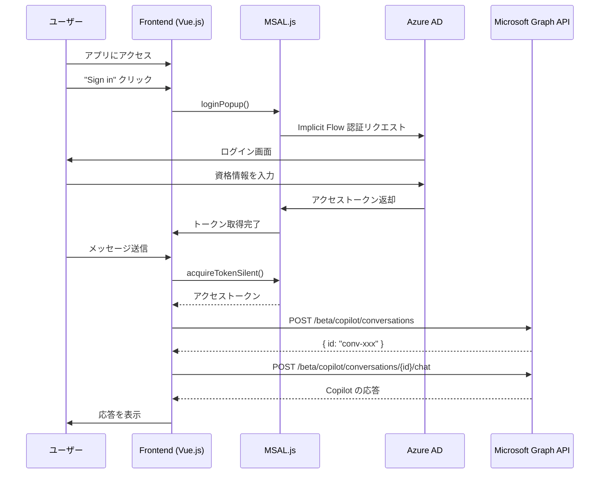
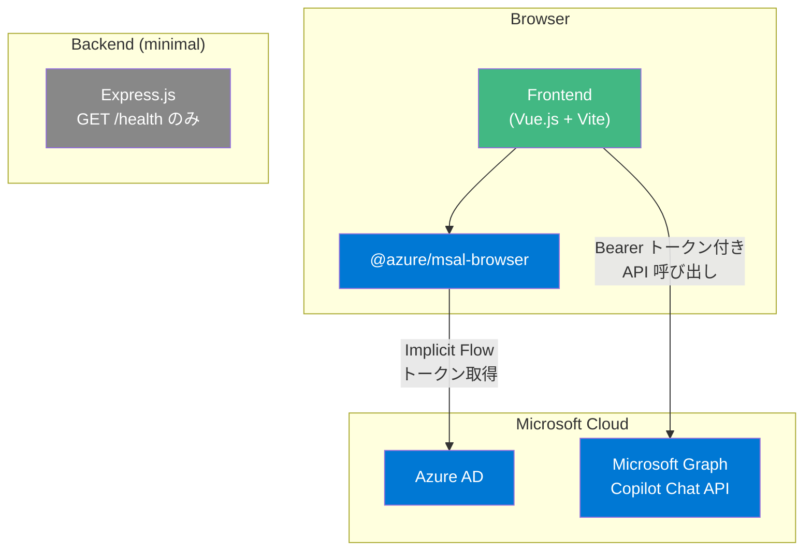

# spa-direct パターン

フロントエンド（SPA）から直接 Microsoft Graph Copilot Chat API を呼び出すパターン。

## アーキテクチャ





## ファイル構成

```
spa-direct/
├── package.json                 # スクリプト集約
├── .env.example                 # 環境変数テンプレート
└── apps/
    ├── backend/
    │   ├── package.json
    │   └── src/
    │       ├── app.js           # createApp() — health check のみ
    │       ├── server.js        # startServer()
    │       └── __tests__/
    │           └── app.test.js
    └── frontend/
        ├── package.json
        ├── vite.config.js
        ├── index.html
        └── src/
            ├── main.js
            ├── App.vue
            ├── msalConfig.js        # MSAL 設定 + スコープ定義
            ├── msalInstance.js       # PublicClientApplication シングルトン
            ├── graphClient.js        # Graph API 呼び出し関数
            ├── components/
            │   ├── LoginButton.vue   # サインインボタン
            │   ├── ChatView.vue      # チャット UI
            │   └── MessageBubble.vue # メッセージ表示
            ├── composables/
            │   ├── useAuth.js        # 認証ロジック (MSAL ラッパー)
            │   └── useChat.js        # チャットロジック (Graph API ラッパー)
            └── __tests__/
```

## 特徴

| 項目 | 内容 |
|------|------|
| 認証フロー | Implicit Flow (MSAL.js) |
| トークン管理 | ブラウザ側（MSAL キャッシュ） |
| Graph API 呼び出し | フロントエンドから直接 |
| バックエンドの役割 | 静的ファイル配信・health check のみ |
| セキュリティ | トークンがブラウザに露出する |

## セットアップ

### 1. Azure AD アプリ登録

1. [Azure Portal](https://portal.azure.com/) → Azure Active Directory → アプリの登録
2. 「新規登録」→ リダイレクト URI に `http://localhost:5173` を SPA として追加
3. 「API のアクセス許可」で以下の Delegated 権限を追加:
   - `Sites.Read.All`, `Mail.Read`, `People.Read.All`
   - `OnlineMeetingTranscript.Read.All`, `Chat.Read`
   - `ChannelMessage.Read.All`, `ExternalItem.Read.All`
4. 「管理者の同意を与える」をクリック

### 2. 環境変数

```bash
cp spa-direct/.env.example spa-direct/.env
```

`.env` を編集:

```
VITE_AZURE_CLIENT_ID=<Azure AD アプリの Client ID>
VITE_AZURE_TENANT_ID=<Azure AD テナント ID>
```

### 3. 開発

```bash
# ルートから
npm install

# フロントエンド開発サーバー
npm run dev --workspace=spa-direct/apps/frontend

# テスト
npm test --workspace=spa-direct/apps/backend
npm test --workspace=spa-direct/apps/frontend
```

## 注意事項

- Microsoft は SPA に対して Implicit Flow を **非推奨** としており、Authorization Code Flow with PKCE を推奨している
- トークンがブラウザに露出するため、XSS 等の脆弱性がある場合にトークンが漏洩するリスクがある
- より安全な実装が必要な場合は `server-mediated` パターンを参照
