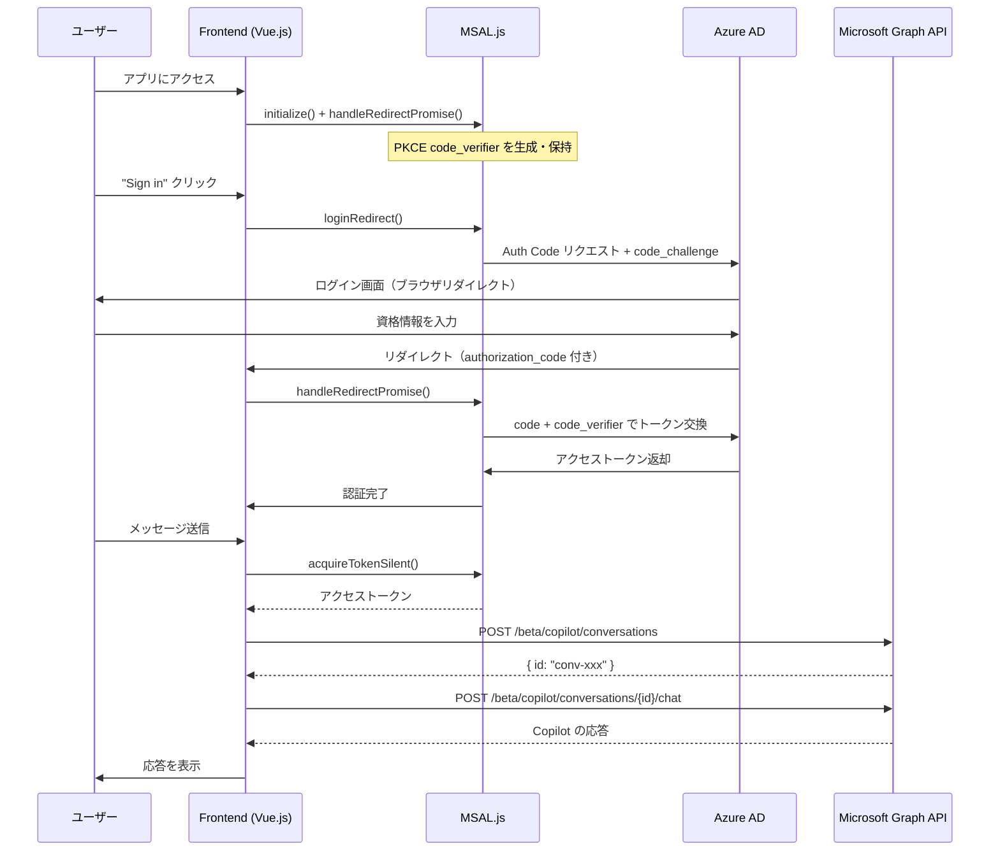
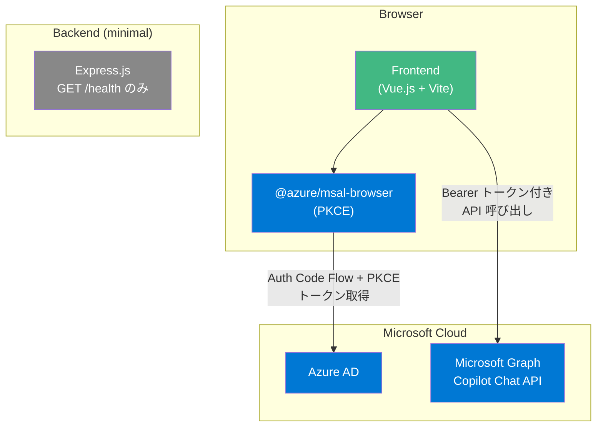

# spa-pkce パターン

フロントエンド（SPA）から直接 Microsoft Graph Copilot Chat API を呼び出すパターン。**Authorization Code Flow with PKCE** を使用する Microsoft 推奨のアプローチ。

## アーキテクチャ





## spa-direct との違い

| 項目 | spa-direct (Implicit Flow) | spa-pkce (Auth Code + PKCE) |
|------|---------------------------|----------------------------|
| 認証フロー | Implicit Flow | Authorization Code Flow + PKCE |
| ログイン方式 | `loginPopup()` | `loginRedirect()` |
| トークン取得 | URL フラグメントで直接返却 | 認可コード → PKCE 検証 → トークン交換 |
| セキュリティ | トークンが URL に露出 | 認可コードのみ URL に露出、code_verifier で保護 |
| キャッシュ | localStorage | sessionStorage（タブスコープ） |
| 初期化 | 不要 | `handleRedirectPromise()` が必要 |
| Microsoft 推奨 | 非推奨 | 推奨 |

## ファイル構成

```
spa-pkce/
├── package.json                 # スクリプト集約
├── .env.example                 # 環境変数テンプレート
└── apps/
    ├── backend/
    │   ├── package.json
    │   └── src/
    │       ├── app.js           # createApp() — health check のみ
    │       ├── server.js        # startServer()
    │       └── __tests__/
    │           └── app.test.js
    └── frontend/
        ├── package.json
        ├── vite.config.js
        ├── index.html
        └── src/
            ├── main.js              # MSAL 初期化 → Vue マウント
            ├── App.vue
            ├── msalConfig.js        # MSAL 設定 + cache + PKCE 設定
            ├── msalInstance.js       # initializeMsal() + handleRedirectPromise()
            ├── graphClient.js       # Graph API 呼び出し関数
            ├── components/
            │   ├── LoginButton.vue   # サインインボタン
            │   ├── ChatView.vue      # チャット UI
            │   └── MessageBubble.vue # メッセージ表示
            ├── composables/
            │   ├── useAuth.js        # 認証ロジック (redirect ベース)
            │   └── useChat.js        # チャットロジック (Graph API ラッパー)
            └── __tests__/
```

## 特徴

| 項目 | 内容 |
|------|------|
| 認証フロー | Authorization Code Flow + PKCE (MSAL.js v4) |
| トークン管理 | ブラウザ側（sessionStorage） |
| Graph API 呼び出し | フロントエンドから直接 |
| バックエンドの役割 | 静的ファイル配信・health check のみ |
| セキュリティ | PKCE によりトークン漏洩リスクを軽減 |

## セットアップ

### 1. Azure AD アプリ登録

1. [Azure Portal](https://portal.azure.com/) → Azure Active Directory → アプリの登録
2. 「新規登録」→ リダイレクト URI に `http://localhost:5173` を **SPA** として追加
3. 「API のアクセス許可」で以下の Delegated 権限を追加:
   - `Sites.Read.All`, `Mail.Read`, `People.Read.All`
   - `OnlineMeetingTranscript.Read.All`, `Chat.Read`
   - `ChannelMessage.Read.All`, `ExternalItem.Read.All`
4. 「管理者の同意を与える」をクリック

> **Note**: SPA のリダイレクト URI として登録することで、Azure AD は PKCE フローを許可する。「Web」ではなく「SPA」を選択すること。

### 2. 環境変数

```bash
cp spa-pkce/.env.example spa-pkce/.env
```

`.env` を編集:

```
VITE_AZURE_CLIENT_ID=<Azure AD アプリの Client ID>
VITE_AZURE_TENANT_ID=<Azure AD テナント ID>
```

### 3. 開発

```bash
# ルートから
npm install

# フロントエンド開発サーバー
npm run dev --workspace=spa-pkce/apps/frontend

# モックモード（Azure AD 不要）
VITE_MOCK_MODE=true npm run dev --workspace=spa-pkce/apps/frontend

# テスト
npm test --workspace=spa-pkce/apps/backend
npm test --workspace=spa-pkce/apps/frontend
```

### 4. Docker Compose で起動

```bash
cd spa-pkce

# .env に VITE_AZURE_CLIENT_ID, VITE_AZURE_TENANT_ID を設定済みであること
docker compose up --build
```

| サービス | URL | 説明 |
|---------|-----|------|
| frontend | http://localhost:8080 | Nginx で配信される SPA |
| backend | http://localhost:3000 | Express.js（health check） |

> **Note**: フロントエンドはビルド時に `VITE_AZURE_CLIENT_ID` / `VITE_AZURE_TENANT_ID` を埋め込むため、`.env` を変更した場合は `docker compose up --build` で再ビルドが必要。

## PKCE フローの詳細

1. **code_verifier 生成**: MSAL.js がランダムな文字列を生成し、セッションに保存
2. **code_challenge 送信**: `code_verifier` の SHA-256 ハッシュを Azure AD に送信
3. **認可コード取得**: ユーザー認証後、Azure AD がリダイレクトで認可コードを返却
4. **トークン交換**: MSAL.js が認可コード + `code_verifier` を使ってトークンを取得
5. **検証**: Azure AD が `code_verifier` と元の `code_challenge` を照合し、同一クライアントであることを確認

これにより、認可コードが傍受されてもトークンに交換できないため、Implicit Flow よりも安全。
